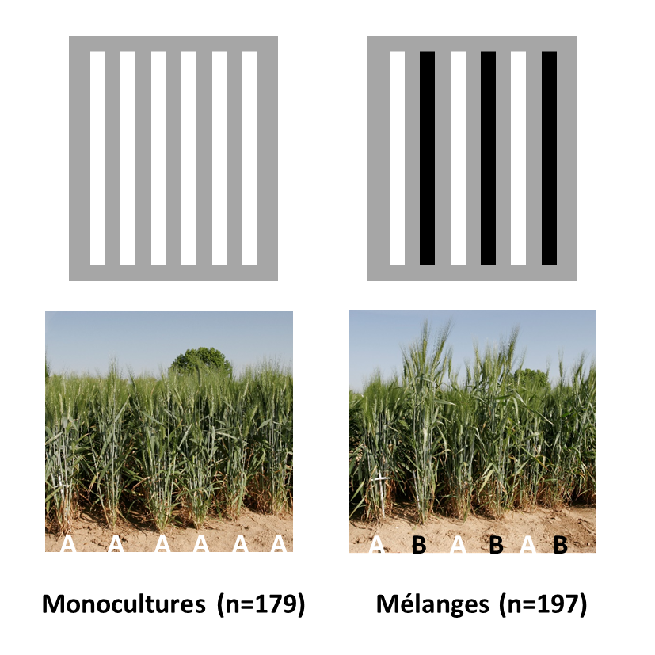

```{r setup, include=FALSE}
knitr::opts_chunk$set(echo = FALSE, eval=FALSE)
library(qqman)
```


# Contexte 

Vous allez ici analyser une partie des données issues d'une expérience au champ ayant eu lieu à Mauguio (34, UE DIASCOPE) lors de la saison 2017-2018 [1]. Cette expérience visait à quantifier et comprendre l'effet de la diverstié génétique intra-parcelle sur la performance agrononmique d'une espèce céréalière majeure, le blé dur. L'expérience est composée de 376 micro-parcelles (~ 2 m^-2^) dont 179 monocultures et 197 mélanges binaires. Les parcelles de monoculture sont composées d'un seul génotype cultivé sur 6 lignes de semis, et les parcelles de mélange sont composées de 3 lignes alternées de chaque génotype (Figure 1). 

2 variables agronomiques ont été mesurées: le rendement en grains (g.m^-2^) et la sévérité de la septoriose. La septoriose est une des principales maladies fongiques affectant la productivité du blé en Europe. Elle est causée par l'agent pathogène Zymoseptoria tritici. Dans cette expérience, la sévérité a été mesurée visuellement à la fin du tallage (stade GS30) en utilisant une échelle de notation allant de 0 (absence de symptômes) à 3 (symtomes présents sur la majorité des plantes et sur l'ensemble des étages foliaires). Cette notation étant assez technique et chronophage, elle n'a pu être effectuée que sur un sous-ensemble de parcelles.

Le but de ce TD est de comparer les effets de la diversité génétique à différentes échelles. Dans un premier temps, vous évaluerez l'effet de la richesse génotypique (nombre de génotypes présents dans la parcelle) sur les rendements et la sévérité de la septoriose. Dans un deuxième temps, vous utiliserez des données génomiques pour tester l'effet de la richesse allélique (nombre d'allèles présents à un locus donné dans la parcelle) à différents loci sur ces deux mêmes variables. Enfin, vous comparerez ces deux effets,i.e., richesse génotypique et richesse allélique, et vous discuterez de leurs implications pour la sélection des mélanges variétaux. 

3 fichiers sont à votre disposition:

- `pheno.csv` contient les mesures de rendement et de sévérité de la septoriose sur l'ensemble des parcelles
- `geno.csv` contient les génotypes des différentes lignées pour 1,158 SNPs situés sur le chromosome 6B (encodage 0,1,2 pour les homozygotes du premier allèle, hétérozygotes, et homozygotes du deuxième allèle, respectivement)
- `map.csv` contient la position physique des 1,158 SNPs sur le chromosome 6B.

<center>



</center>

# Observation des données

1. Chargez le jeu de données. Vérifiez que vous avez bien le nombre attendu de parcelles de monocultures et de mélanges. Combien de génotypes ont été observés en monoculture ? Combien de génotypes ont été observés en mélange ? Est-ce que tous les génotypes observés en mélange ont été observés en monoculture ?

2. Sur combien de parcelles de mélanges et de monocultures les rendements ont-ils été mesurés ? Même question pour la septoriose ?

3. Que pouvez-vous dire de la distribution des données pour les deux variables agronomiques mesurées ?

```{r}
data <- read.csv("data/pheno.csv", header=T, sep=",")
str(data)
table(data$plot_type) ## Il y a bien le bon nombre de parcelles attendu
genoM <- unique(data[which(data$plot_type=="M"),"genotype1"])
genoP <- unique(c(data[which(data$plot_type=="P"),"genotype1"], data[which(data$plot_type=="P"),"genotype2"]))
length(genoM) ### 179 genotypes utilisés dans les monocultures
length(genoP) ### 156 genotypes utilisés dans les melanges
length(intersect(genoP, genoM)) ### Tous les génotypes utilisés dans les mélanges ont été observés en monoculture
setdiff(genoP, genoM) 

sum(!is.na(data$GY[data$plot_type=="M"]))
sum(!is.na(data$GY[data$plot_type=="P"]))
## Les rendements ont été mesurés sur toutes les parcelles

sum(!is.na(data$STB[data$plot_type=="M"]))
sum(!is.na(data$STB[data$plot_type=="P"]))
## La sévérité de la septoriose a été mesurée sur 166 parcelles en monoculture et 58 parcelles en mélange

par(mfrow=c(1,2))
hist(data$GY)
hist(data$STB)
## Les données semblent avoir une distribution normale, sans outliers apparents. 
```

# Comparaison des monocultures et des mélanges

## Comparaison absolue: effet de la richesse génotypique

1. La productivité des mélanges a-t-elle été, en moyenne, supérieure, inférieure, ou égale à la productivité des monocultures ?

2. La sévérité de la septoriose dans les mélanges a-t-elle été, en moyenne, supérieure, inférieure, ou égale à la sévérité dans les monocultures ?

```{r}
## Séparons dans un premier temps le jeu de données entre les monocultures et les mélanges
dataM <- data[which(data$plot_type=="M"),]
dataP <- data[which(data$plot_type=="P"),]

## Calculons la productivité moyenne et la sévérité moyenne dans les mélanges (la moyenne des 2 composantes)
dataP_avg <- aggregate(cbind(GY, STB)~pair+plot_type, data=dataP, FUN = mean, na.action = "na.pass")

## Re-assemblons les monocultures et les mélanges (qui sont maintenant moyennés)
data_plot <- rbind(dataM[,c("pair","plot_type","GY","STB")], dataP_avg)

boxplot(GY~plot_type, data=data_plot)
comp_GY<- lm(GY~plot_type, data=data_plot)
anova(comp_GY)
## Il ne semble pas y avoir de différence significative de rendement entre les monocultures et les mélamges

boxplot(STB~plot_type, data=data_plot)
comp_STB <- lm(STB~plot_type, data=data_plot)
anova(comp_STB)
## Les mélanges sont significativement moins touchés par la septoriose que les monocultures
```

## Comparaison relative

En agronomie comme en écologie, il est commun d'évaluer la performance d'un mélange en comparant la productivité d'une surface donnée de ce mélange par rapport à la productivité de la même surface si elle avait été subdivisée entre les cultures pures des composantes du mélange selon le même ratio que dans le mélange. L'index le plus couramment utilisé pour faire ce type de comparaison est le Relative Yield Total (RYT)[2,3]. Un index équivalent, le Land Equivalent Ratio (LER)[2,4], est couramment utilisé pour comparer la productivité des cultures associées (mélanges d'espèces, par exemple blé & pois) à la productivité de leurs cultures pures. 

Pour comprendre l'intérêt de ces index, prenons un exemple. Imaginons deux génotypes de blé, A et B, produisant respectivement 3000 et 1000 kg de grains/ha en culture pure. Imaginons maintenant que ces deux génotypes sont cultivés dans un mélange 50:50 (par exemple en rangs alternes) et produisent respectivement 2250 et 250 kg de grains/ha dans le mélange. La productivité totale du mélange est donc de 2500 kg de grains/ha. A première vue, il semble donc que le mélange soit  plus productif que les monocultures puisqu'on s'attendrait à avoir 1500 kg de grains/ha pour le génotype A et 500 kg/ha pour le génotype B, soit 2000 kg/ha au total. Cependant, cette productivité attendue est basée sur un ratio de 50:50 dans le mélange (ratio au semis). Or, nous voyons que le ratio observé est de 75:25: le génotype A produit 75% de sa productivité en monoculture, le génotype B produit 25% de sa productivité en monoculture. Ainsi, il serait possible pour un agriculture d'obtenir le même rendement que celui observé dans le mélange en cultivant les deux génotypes en monoculture sur la même surface avec 75% de la surface couverte par le génotype A et 25% de la surface couverte par le génotype B. L'avantage du mélange n'est donc réel que lorsque la somme des ratio de productivité des composante dépasse 100 (ou 1). On parle alors d'overyielding ("sur-rendement"). Dans le cas où il y a overyielding, il est impossible d'obtenir le rendement observé dans le mélange en cultivant les composantes pures sur la même surface, quel que soit leurs ratios. Les index RYT et LER (équivalents dans la plupart des cas) sont définis comme la somme des productivités relatives des composantes du mélange pondérées par leur proportion au semis:


$$RYT_{AB} = RY_{A} + RY_{B} = \frac{Y_{A_{mixt}}}{Y_{A_{mono}}}p_A + \frac{Y_{B_{mixt}}}{Y_{B_{mono}}}p_B$$
Où $RYT_{AB}$ est le rendement relatif total du mélange A et B, $RY_{A}$ est le rendement relatif de A, $Y_{A_{mixt}$ est le rendement de A dans le mélange, $Y_{A_{mono}}$ est le rendement de A en monoculture, et $p_A$ est la proportion de A dans le mélange (idem pour B).

Interprétation: 

- $RYT = 1$ : pas de différence entre la productivité du mélange et celle des monocultures
- $RYT > 1$ : overyielding
- $RYT < 1$ : underyieling


3. Calculez les index RYT pour le rendements et la sévérité de la septoriose. Que pouvez-vous conclure ?

```{r}
## Calculons l'index RYT

for (var in c("GY","STB")) { ## le calcul sera répété pour les deux variables: rendement et sévérité de la septoriose
  for(i in 1:nrow(dataP_avg)) { ## le calcul sera fait parcelle par parcelle 
    
    foc <- as.character(paste(strsplit(dataP_avg[i,"pair"],"_")[[1]][1], strsplit(dataP_avg[i,"pair"],"_")[[1]][2],sep="_")) ## identité du génotype focal
    nei <- as.character(paste(strsplit(dataP_avg[i,"pair"],"_")[[1]][3], strsplit(dataP_avg[i,"pair"],"_")[[1]][4],sep="_")) ## identité du génotype voisin
    pr <- as.character(dataP_avg[i,"pair"])  ## identité de la paire de génotypes
    
    ## On calcule les Relative Yields (RY) de chacunes des 2 composantes
    RY_foc <- dataP[which(dataP$pair==pr & dataP$genotype1==foc),var]/dataM[which(dataM$genotype1==foc),var]*0.5
    RY_nei <- dataP[which(dataP$pair==pr & dataP$genotype1==nei),var]/dataM[which(dataM$genotype1==nei),var]*0.5
    
    ## Si le RY est manquant pour une des 2 composantes, la valeur de RYT pour le mélange est "NA"
    if (length(RY_foc)==0|length(RY_nei)==0) {
      dataP_avg[i,paste("RYT",var,sep="_")] <- NA
    } else { ## Sinon le RYT est la somme des 2 RY 
      dataP_avg[i,paste("RYT",var,sep="_")] <- RY_foc + RY_nei
    } 
  }
}

par(mfrow=c(1,2))

hist(dataP_avg$RYT_GY)
abline(v=1, lty=2, lwd=2, col="blue")
hist(dataP_avg$RYT_STB)
abline(v=1, lty=2, lwd=2, col="blue")

mean(dataP_avg$RYT_GY)
t.test(dataP_avg$RYT_GY, mu=1)

mean(dataP_avg$RYT_STB, na.rm=T)
t.test(dataP_avg$RYT_STB, mu=1)

## Les mélanges sont en moyennes plus productifs que leurs composantes pures. Ils sont également beaucoup moins affectés par la septoriose 
```
# Effet de la richesse allélique

Vous disposez de données génomiques correspondant à 1,158 marqueurs SNPs (Single Nucleotide Polymorphisms) se situant sur le chromosome 6B du blé dur. Les marqueurs SNPs utilisés sont bi-alléliques. Pour rappel, le blé dur est une espèce auto-fécondante dont la majorité des individus sont des lignées pures. 

4. Selon vous, pour un locus donné, quelle peut être la richesse allélique (= nombre d'allèle observé) dans les différents types de parcelles (monoculture vs mélanges) ?

5. Calculez une matrice correspondant à la richesse allélique observée dans chaque parcelle (dimensions = nb parcelles x nb SNPs)

6. A l'aide de cette matrice, testez successivement l'effet de la richesse allélique à chacun des 1,158 SNPs sur les rendements. 

7. En utilisant le fichier `map.csv` et la fonction `manhattan()` du package `qqman`, visualisez les résultats de ces tests à l'aide d'un graphique.

8. Comme vous venez d'effectuer un très grand nombre de tests (1,158), il convient de corriger le seuil de significativité pour détecter les SNPs auxquels la richesse allélique est significativement associée aux rendements. Pour ce faire, nous allons ici utiliser une procédure de contrôle du "False Discovery Rate" (FDR, "Taux de faux positifs") à 5%. Contrôler le FDR à 5% (ou 0.05) nous garantit que, parmi tous les signaux significatifs, 5% ou moins seront de faux-positifs. Pour calculer le FDR en utilisant la procédure de Benjamini & Hochberg, regardez l'aide de la fonction `p.adjust()` du package `stats`.

9. Pour le ou les SNPs significatifs, la richesse allélique a-t-elle un effet positif ou négatif sur les rendements ?

10. Pour le ou les SNPs significatifs, la richesse allélique a-t-elle un effet positif ou négatif sur la sévérité de la septoriose ?

11. Testez maintenant simultanément l'effet de richesse allélique et de la richesse génotypique sur les rendements. Que pouvez-vous conclure ?

```{r}
### Chargement des données génotypiques
geno <- read.csv("data/geno.csv", header = T, sep=",")
dim(geno)
geno[1:5,1:5]
row.names(geno) <- geno$X
geno <- geno[,-1]
geno[1:5,1:5]

### Pour un locus donné la richesse allélique vaut toujours 1 dans les monocultures (1 seul génotype homozygote), et elle peut prendre les valeurs 1 ou 2 dans les mélanges binaires, selon que les deux génotypes partagent le même allèle (1) ou pas (2).

### Calcul de la matrice des richesses alléliques

RIC <- matrix(NA, nrow=nrow(dataP_avg), ncol=ncol(geno))
dimnames(RIC) <- list(dataP_avg$pair, colnames(geno))

for (i in 1:nrow(RIC)) {
  
  geno1 <- as.character(paste(strsplit(dataP_avg[i,"pair"],"_")[[1]][1], strsplit(dataP_avg[i,"pair"],"_")[[1]][2],sep="_"))
  geno2 <- as.character(paste(strsplit(dataP_avg[i,"pair"],"_")[[1]][3], strsplit(dataP_avg[i,"pair"],"_")[[1]][4],sep="_"))
  
  for (j in 1:ncol(RIC)) {
    
    SNP1 <- geno[geno1, j]
    SNP2 <- geno[geno2, j]
    
    if (SNP1 == SNP2) {
      
      RIC[i, j] <- 1
      
    } else {
      
      RIC[i, j] <- 2
      
    }
  }
}

dim(RIC)

### On teste l'effet de la richesse allélique sur les rendements à l'aide d'une ANOVA 1 facteur pour chaque locus/SNP.
scores <- data.frame(snp=colnames(RIC), p_val=rep(NA,ncol(RIC)))

for (j in 1:ncol(RIC)) {
  df <- data.frame(GY=dataP_avg$GY, geno=RIC[,j])
  mod <- lm(GY~geno, data=df)
  p <- anova(mod)$"Pr(>F)"[1]
  scores[j,"p_val"] <- p
  
}

### On transforme les p-valeurs selon la procédure de Benjamini-Hochberg pour calculer le FDR à 5%. 
qvalues <- p.adjust(scores$p_val, method="BH")
FDR_05 <- max(scores$p_val[which(qvalues<=0.05)])


### On visualise le résultat sous la forme d'un Manhattan plot
map <- read.table("data/pos.csv", header = T, sep=",", row.names = 1)
scores <- merge(scores, map, by="snp")
qqman::manhattan(scores, chr="chr", bp="pos", p="p_val", snp="snp", logp = T, genomewideline = -log10(FDR_05), suggestiveline = FALSE)

### On identifie le SNP significatif et on visualise son effet à l'aide de 2 boxplots (rendement et septoriose)
scores[which.min(scores$p_val),]
dataP_avg <- cbind(dataP_avg, RIC=RIC[,"cfn0881580"])

par(mfrow=c(1,2))
boxplot(GY~RIC, data=dataP_avg)
comp_GY<- lm(GY~RIC, data=dataP_avg)
anova(comp_GY)

boxplot(STB~RIC, data=dataP_avg)
comp_STB<- lm(STB~RIC, data=dataP_avg)
anova(comp_STB)
## La richesse allélique a un effet négatif sur les rendements: les parcelles bi-allèliques sont moins productives que les parcelles mono-alléliques
## La richesse allélique a un effet positif sur la sévérité de la septoriose: les parcelles bi-allèliques sont plus touchées par la maladie que les parcelles mono-alléliques


### Testons simultanément l'effet de la richesse génotypique et de la richesse allélique
data_plot <- cbind(data_plot, RIC=c(rep(1,179),RIC[,"cfn0881580"]))
mod <- lm(GY ~ RIC + plot_type, data=data_plot)
anova(mod)
summary(mod)

### L'effet de la richesse génotypique devient significatif lorsqu'on ajoute l'effet de la richesse allélique dans le modèle. 
### L'effet de la richesse génotypique est positif, mais son effet est plus faible que celui de la richesse allélique (+35.92 vs -51.97)

## CONCLUSION
### Dans cette expérience, les mélanges ont été en moyenne plus productifs et moins atteints par la septoriose que leur composantes pures, suggérant un effet positif de la richesse génotypique sur la performance agronomique. Ce résultat correspond à ce qui est classiquement reporté dans la littérature. Cependant, nous avons identifié un locus auquel la richesse allélique était associée négativement au rendement, très vraissemblablement via une sévérité accrue de la septoriose dans les parcelles bi-alléliques. Cet effet étant du même ordre de grandeur, et même lègèrement plus fort que l'effet de la richesse génotypique, il peut expliquer pourquoi l'effet de la richesse génotypique n'était pas détectable dans un modèle n'incluant pas la richesse allélique. Il explique également une partie de la variabilité de la performance relative des mélanges par rapport à leur composantes pures. 

### Ce résultat suggère que la diversité n'a pas toujours un effet positif sur la performance agronomique, et qu'il est donc important de (i) s'intéresser à la composition allélique des mélanges, (ii) identifier les locus impliqués dans des effets de diversité, (iii) guider l'assemblage des variétés sur la base de ces effets ("assemblage assisté par marqueur")
```

# Références

[1] Montazeaud, G.; Flutre, T., Ballini, E.; Morel, J.B.; David, J.; Girodolle, J.; Rocher, A.; Ducasse, A.; Violle, C.; Fort, F.; Fréville, F. et al. From cultivar mixtures to allelic mixtures: opposite effects of allelic richness between genotypes and genotype richness in wheat. *Under revisions*.

[2] Weigelt, A.; Jolliffe, P. Indices of Plant Competition. *Journal of Ecology* **2003**, 91, 707–720.

[3] de Wit, C.T.; van den Bergh, J.P. Competition between Herbage Plants. *Journal of Agricultural Science* **1965**, 13, 212–221.

[4] Willey, R.W.; Osiru, D.S.O. Studies on Mixtures of Maize and Beans (*Phaseolus Vulgaris*) with Particular Reference to Plant Population. *The Journal of Agricultural Science* **1972**, 79, 517–529.
